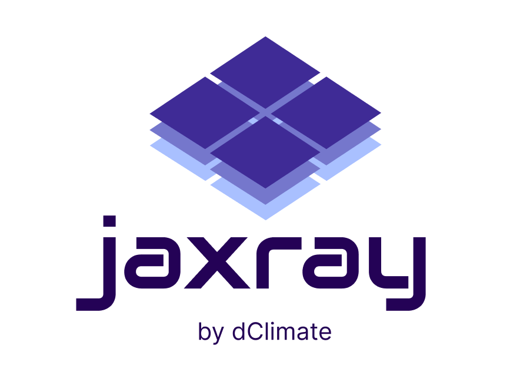

<div align="center">
  
  <p><strong>Labeled multi-dimensional arrays for JavaScript</strong></p>

  [](https://www.npmjs.com/package/@dclimate/jaxray)
  
  [](LICENSE)
  [](https://www.typescriptlang.org/)

  <p>A JavaScript/TypeScript implementation inspired by Python's <a href="https://xarray.pydata.org/">xarray</a> library</p>

  <p>
    <a href="#features">Features</a> •
    <a href="#installation">Installation</a> •
    <a href="#quick-start">Quick Start</a> •
    <a href="#api-reference">API</a> •
    <a href="#examples">Examples</a>
  </p>
</div>

---

## Why jaxray?

Working with multi-dimensional labeled data in JavaScript shouldn't be painful. jaxray brings the power of Python's xarray to the JavaScript ecosystem, making it easy to work with scientific data, climate datasets, and any labeled arrays.

**Perfect for:**
- 🌍 Climate and weather data analysis
- 📊 Time series with multiple dimensions
- 🗺️ Geospatial data processing
- 🔬 Scientific computing in the browser
- 📈 Large dataset streaming and processing

## Features

- ✨ **Labeled Arrays**: Named dimensions and coordinates like xarray
- 🎯 **Smart Selection**: Select by labels with nearest neighbor, forward/backward fill
- 🌊 **Streaming**: Process massive datasets chunk-by-chunk with progress tracking
- 📦 **Zarr Support**: Read sharded Zarr stores directly from IPFS
- 🔐 **Encryption**: Transparent XChaCha20-Poly1305 authenticated encryption for Zarr datasets
- 🔒 **Type-Safe**: Full TypeScript support with complete type definitions
- 💨 **Memory Efficient**: Stream large selections without loading everything
- 🔄 **Immutable**: All operations return new instances

## Installation

```bash
npm install @dclimate/jaxray
```

## Quick Start

### Creating a DataArray

```typescript
import { DataArray } from '@dclimate/jaxray';

// Simple 1D array with labeled coordinates
const temperatures = new DataArray([20, 22, 25, 23, 21], {
  dims: ['time'],
  coords: {
    time: ['Mon', 'Tue', 'Wed', 'Thu', 'Fri']
  },
  attrs: {
    units: 'celsius',
    description: 'Daily temperatures'
  }
});

console.log(temperatures.data);  // [20, 22, 25, 23, 21]
console.log(temperatures.shape); // [5]
```

### Creating a 2D DataArray

```typescript
const gridData = new DataArray(
  [
    [1, 2, 3],
    [4, 5, 6]
  ],
  {
    dims: ['y', 'x'],
    coords: {
      y: [0, 10],
      x: [0, 10, 20]
    }
  }
);
```

### Selecting Data

```typescript
// Select by label
const wednesday = await temperatures.sel({ time: 'Wed' });
console.log(wednesday.data); // 25

// Select multiple values
const selected = await temperatures.sel({ time: ['Mon', 'Wed', 'Fri'] });
console.log(selected.data); // [20, 25, 21]

// Slice selection
const midweek = await temperatures.sel({ time: { start: 'Tue', stop: 'Thu' } });
console.log(midweek.data); // [22, 25, 23]

// Select by integer position
const byIndex = await temperatures.isel({ time: 2 });
console.log(byIndex.data); // 25
```

### Nearest Neighbor Selection

jaxray supports xarray-style nearest neighbor lookups and interpolation methods:

```typescript
const data = new DataArray([10, 20, 30, 40, 50], {
  dims: ['x'],
  coords: {
    x: [0, 5, 10, 15, 20]
  }
});

// Find nearest coordinate
const nearest = await data.sel({ x: 7 }, { method: 'nearest' });
console.log(nearest.data); // 20 (nearest to x=7 is x=5)

// Forward fill (last value <= target)
const ffill = await data.sel({ x: 12 }, { method: 'ffill' });
console.log(ffill.data); // 30 (last value where x <= 12 is x=10)

// Backward fill (first value >= target)
const bfill = await data.sel({ x: 12 }, { method: 'bfill' });
console.log(bfill.data); // 40 (first value where x >= 12 is x=15)

// With tolerance
const tolerant = await data.sel({ x: 7 }, {
  method: 'nearest',
  tolerance: 3
});
// Succeeds because distance is 2

// This would throw an error (distance 7 > tolerance 2)
await data.sel({ x: 13 }, { method: 'nearest', tolerance: 2 });
```

### Open an IPFS-hosted Zarr dataset with a single CID

jaxray can auto-detect whether a CID points to a sharded Zarr store or a HAMT-backed one. All you need is the CID:

```typescript
import { Dataset, openIpfsStore } from '@dclimate/jaxray';

const cid = 'bafy…';

// Automatically detects the underlying layout and selects the correct store
const { type, store } = await openIpfsStore(cid);
console.log(`Detected store type: ${type}`); // "sharded" or "hamt"

// Use the store with the regular Dataset API
const ds = await Dataset.open_zarr(store);

// Work with the dataset immediately
console.log(ds.dataVars);
const snapshot = await ds.sel({
  latitude: 45,
  longitude: 34,
  time: '2025-09-02T00:00:00Z'
});
console.log(snapshot.getVariable('temperature').values);
```

The helper uses dClimate's public gateway by default. Provide your own gateway or custom IPFS primitives when needed:

```typescript
import { createIpfsElements, openIpfsStore } from '@dclimate/jaxray';

await openIpfsStore(cid, { gatewayUrl: 'https://ipfs.my-org.dev' });
// or reuse your own IPFS primitives
const customElements = createIpfsElements('https://ipfs.my-org.dev');
const { type, store } = await openIpfsStore(cid, { ipfsElements: customElements });
```

### Encryption and Decryption

jaxray supports transparent encryption and decryption of Zarr datasets using XChaCha20-Poly1305 authenticated encryption. This provides both confidentiality and integrity protection for your data.

#### Registering the Encryption Codec

Before opening encrypted datasets, register the encryption codec with your key management:

```typescript
import { registerXChaCha20Poly1305Codec } from '@dclimate/jaxray';

// Register with a hex-encoded 256-bit key
registerXChaCha20Poly1305Codec({
  getKey: () => '00112233445566778899aabbccddeeff00112233445566778899aabbccddeeff',
  // Optional: customize nonce generation (defaults to crypto.getRandomValues)
  // nonceGenerator: () => crypto.getRandomValues(new Uint8Array(24))
});
```

**Key Management Best Practices:**
- 🔑 **Key Generation**: Use cryptographically secure random number generators to create 256-bit (32 byte) keys
- 🔒 **Key Storage**: Store keys securely using environment variables, key management services (KMS), or secure enclaves
- 🎲 **Nonce Generation**: The default nonce generator uses `crypto.getRandomValues()` for secure randomness. Each encryption operation automatically generates a fresh nonce
- ⚠️ **Never reuse nonces** with the same key - the implementation handles this automatically

#### Opening Encrypted Datasets

Once the codec is registered, encrypted datasets can be opened transparently:

```typescript
import { ZarrBackend } from '@dclimate/jaxray';

// Open an encrypted Zarr store
const dataset = await ZarrBackend.open(encryptedStore);

// Check if the dataset is encrypted
console.log(dataset.isEncrypted); // true

// Access data - decryption happens automatically
const variable = dataset.getVariable('temperature');
const data = await variable.compute();
console.log(data.data); // Decrypted values
```

#### Encryption Detection

jaxray automatically detects encrypted datasets by inspecting the Zarr metadata for XChaCha20-Poly1305 codecs:

```typescript
const dataset = await ZarrBackend.open(store);

if (dataset.isEncrypted) {
  console.log('Dataset contains encrypted variables');
  // Ensure codec is registered with correct key
}
```

#### How It Works

1. **Encryption**: When data is written, each chunk is encrypted with a randomly generated 24-byte nonce. The nonce is prepended to the ciphertext (first 24 bytes)
2. **Decryption**: When reading, the nonce is extracted from the chunk, and the data is decrypted and authenticated
3. **Authentication**: XChaCha20-Poly1305 includes a 16-byte authentication tag that protects against tampering. Decryption will fail if the data has been modified or if the wrong key is used

#### Error Handling

If decryption fails (wrong key, corrupted data, or tampering detected), an error will be thrown:

```typescript
try {
  const data = await variable.compute();
} catch (error) {
  if (error.message.match(/tag|auth/i)) {
    console.error('Decryption failed: Invalid key or corrupted data');
  }
}
```

#### Security Considerations

- ✅ **Authenticated Encryption**: XChaCha20-Poly1305 provides both confidentiality and integrity
- ✅ **Unique Nonces**: Each encryption operation uses a fresh random nonce
- ✅ **Extended Nonce**: XChaCha20 uses 192-bit nonces, eliminating collision concerns
- ⚠️ **Key Protection**: The security depends entirely on keeping your encryption keys secret
- ⚠️ **Metadata**: Zarr metadata (array shapes, dimension names, etc.) is not encrypted

See the [xchacha20poly1305 example](examples/xchacha20poly1305.ts) for a complete working example.

### Streaming Large Datasets

For large datasets that don't fit in memory, use streaming to process data in chunks:

```typescript
// Stream large time series data
const largeData = new DataArray(/* ... large array ... */, {
  dims: ['time'],
  coords: { time: /* ... */ }
});

const stream = largeData.selStream(
  { time: ['2020-01-01', '2020-12-31'] },
  { chunkSize: 50 } // Process in 50MB chunks
);

for await (const chunk of stream) {
  console.log(`Progress: ${chunk.progress}%`);
  console.log(`Processing ${chunk.bytesProcessed} / ${chunk.totalBytes} bytes`);

  // Process this chunk (e.g., write to file, compute statistics)
  await processChunk(chunk.data);
}
```

Streaming also works with Datasets:

```typescript
const stream = dataset.selStream(
  { time: ['2020-01-01', '2020-12-31'], lat: 45, lon: -73 },
  { chunkSize: 100, method: 'nearest' }
);

for await (const chunk of stream) {
  const temp = chunk.data.getVariable('temperature');
  const pressure = chunk.data.getVariable('pressure');

  // Write chunk to disk or process incrementally
  await writeToFile(temp, pressure);
}
```

### Aggregations

```typescript
// Sum all values
const total = temperatures.sum();
console.log(total); // 111

// Mean of all values
const average = temperatures.mean();
console.log(average); // 22.2

// Sum along a dimension
const rowSums = gridData.sum('x');
console.log(rowSums.data); // [6, 15]
```

### Working with Datasets

```typescript
import { DataArray, Dataset } from '@dclimate/jaxray';

// Create multiple related DataArrays
const temp = new DataArray(
  [[15, 16], [18, 19]],
  {
    dims: ['lat', 'lon'],
    coords: {
      lat: [40.0, 40.5],
      lon: [-74.0, -73.5]
    }
  }
);

const pressure = new DataArray(
  [[1013, 1014], [1012, 1013]],
  {
    dims: ['lat', 'lon'],
    coords: {
      lat: [40.0, 40.5],
      lon: [-74.0, -73.5]
    }
  }
);

// Combine into a Dataset
const weather = new Dataset({
  temperature: temp,
  pressure: pressure
});

console.log(weather.dataVars); // ['temperature', 'pressure']
console.log(weather.dims);     // ['lat', 'lon']

// Select from Dataset
const location = await weather.sel({ lat: 40.0, lon: -73.5 });
const tempAtLocation = location.getVariable('temperature');
console.log(tempAtLocation?.data); // 16

// Works with nearest neighbor too
const nearLocation = await weather.sel(
  { lat: 40.2, lon: -73.7 },
  { method: 'nearest' }
);
```

### Merging Datasets

```typescript
const humidity = new DataArray([[65, 70], [68, 72]], {
  dims: ['lat', 'lon'],
  coords: {
    lat: [40.0, 40.5],
    lon: [-74.0, -73.5]
  }
});

const humidityData = new Dataset({ humidity });
const combined = weather.merge(humidityData);

console.log(combined.dataVars); // ['temperature', 'pressure', 'humidity']
```

### Concatenating Datasets

Concatenate datasets along a dimension to combine time-series data from multiple sources. This is particularly useful for joining finalized and non-finalized data, or combining historical and recent observations:

```typescript
// Create first dataset (historical data)
const historical = new Dataset({
  temperature: new DataArray(
    [[15.2, 16.8], [18.3, 19.1], [20.5, 21.2]],
    {
      dims: ['time', 'location'],
      coords: {
        time: ['2020', '2021', '2022'],
        location: ['Station-A', 'Station-B']
      }
    }
  )
});

// Create second dataset (recent data)
const recent = new Dataset({
  temperature: new DataArray(
    [[22.1, 23.4], [24.2, 25.1]],
    {
      dims: ['time', 'location'],
      coords: {
        time: ['2023', '2024'],
        location: ['Station-A', 'Station-B']
      }
    }
  )
});

// Concatenate along time dimension
const combined = historical.concat(recent, { dim: 'time' });

console.log(combined.sizes.time); // 5
console.log(combined.coords.time); // ['2020', '2021', '2022', '2023', '2024']

// Query across both datasets
const data = await combined.sel({ time: ['2021', '2022', '2023'] });
const computed = await data.compute();
console.log(computed.getVariable('temperature').data);
// [[18.3, 19.1], [20.5, 21.2], [22.1, 23.4]]
```

**Key Features:**
- 🔗 **Lazy Evaluation**: The result is a lazy dataset that only fetches data when needed
- 🎯 **Smart Routing**: Automatically queries the correct source dataset(s) based on selection
- 📊 **Multi-Variable**: Works with datasets containing multiple variables
- ✅ **Validation**: Ensures dimensions and variables match across datasets

**Use Cases:**
- Combining finalized and provisional weather data
- Joining historical archives with recent observations
- Merging data from different time periods or sources

See the [concat-datasets example](examples/concat-datasets.ts) for more details.

### Conditional Selection with Where

Use the `where()` method to filter data based on conditions. Create conditions using comparison methods like `.lt()`, `.gt()`, `.le()`, `.ge()`:

```typescript
const data = new DataArray([10, 20, 30, 40, 50], {
  dims: ['time'],
  coords: { time: ['Mon', 'Tue', 'Wed', 'Thu', 'Fri'] }
});

// Filter where values > 25 (keep values meeting condition, replace others with NaN)
const condition = data.gt(25);
const filtered = data.where(condition);
console.log(filtered.data); // [NaN, NaN, 30, 40, 50]

// Replace values not meeting condition with 0
const replaced = data.where(condition, 0);
console.log(replaced.data); // [0, 0, 30, 40, 50]

// Works with datasets too
const temp = weather.getVariable('temperature');
const hot = temp.gt(15);
const filtered_weather = weather.where(hot);
// Both temperature and pressure filtered by the condition
```

Available comparison methods: `.lt()`, `.le()`, `.gt()`, `.ge()`, `.equal()`, `.notEqual()`

### Rolling Windows

Calculate rolling statistics over a dimension:

```typescript
const temps = new DataArray([10, 15, 20, 18, 22, 25, 23], {
  dims: ['time'],
  coords: { time: ['Mon', 'Tue', 'Wed', 'Thu', 'Fri', 'Sat', 'Sun'] }
});

// Rolling mean with window size 3
const rolling_mean = temps.rolling('time', 3).mean();
console.log(rolling_mean.data);
// [NaN, NaN, 15, 17.67, 20, 21.67, 23.33]

// Rolling sum
const rolling_sum = temps.rolling('time', 3).sum();
console.log(rolling_sum.data);
// [NaN, NaN, 45, 53, 60, 65, 70]

// Works with datasets
const rolling_weather = weather.rolling('lat', 2).mean();
// Both temperature and pressure computed with rolling mean
```

### Renaming Variables

Rename data variables in a dataset:

```typescript
const weather = new Dataset({
  temperature: temp,
  pressure: pressure
});

// Rename single variable
const renamed = weather.rename({ temperature: 'temp' });
console.log(renamed.dataVars); // ['temp', 'pressure']

// Rename multiple variables
const renamed_all = weather.rename({
  temperature: 'temp',
  pressure: 'pres'
});
console.log(renamed_all.dataVars); // ['temp', 'pres']
```

### Assigning Coordinates

Update or add coordinates to a dataset:

```typescript
const weather = new Dataset({
  temperature: temp,
  pressure: pressure
});

// Update existing coordinates
const updated = weather.assignCoords({
  lat: [41.0, 41.5],  // New latitude values
  lon: [-75.0, -74.5] // New longitude values
});

// Coordinates can also be DataArrays
const new_lats = new DataArray([41.0, 41.5], {
  dims: ['lat']
});
const updated2 = weather.assignCoords({ lat: new_lats });
```

### Dropping Variables

Remove variables from a dataset:

```typescript
const weather = new Dataset({
  temperature: temp,
  pressure: pressure,
  humidity: humidity
});

// Drop single variable
const dropped = weather.dropVars('humidity');
console.log(dropped.dataVars); // ['temperature', 'pressure']

// Drop multiple variables
const dropped_multiple = weather.dropVars(['humidity', 'pressure']);
console.log(dropped_multiple.dataVars); // ['temperature']
```

### Squeezing Dimensions

Remove dimensions of size 1:

```typescript
const data = new DataArray(
  [[[1, 2, 3]]],
  {
    dims: ['x', 'y', 'z'],
    coords: {
      x: [0],      // size 1 - will be squeezed
      y: [10],     // size 1 - will be squeezed
      z: [100, 101, 102]
    }
  }
);

const squeezed = data.squeeze();
console.log(squeezed.dims);   // ['z']
console.log(squeezed.shape);  // [3]
console.log(squeezed.data);   // [1, 2, 3]

// Works with datasets too
const squeezed_weather = weather.squeeze();
// All dimensions of size 1 are removed from all variables
```

## API Reference

### DataArray

#### Constructor

```typescript
new DataArray(data, options?)
```

**Parameters:**
- `data`: Multi-dimensional array of values
- `options`:
  - `dims`: Array of dimension names
  - `coords`: Coordinate values for each dimension
  - `attrs`: Metadata attributes
  - `name`: Name of the DataArray

#### Properties

- `data`: Get the underlying data
- `values`: Alias for data
- `dims`: Array of dimension names
- `shape`: Array of dimension sizes
- `coords`: Coordinate values
- `attrs`: Metadata attributes
- `name`: Name of the DataArray
- `ndim`: Number of dimensions
- `size`: Total number of elements

#### Methods

- `sel(selection, options?)`: Select by coordinate labels
  - `options.method`: Selection method ('nearest', 'ffill', 'bfill', 'pad', 'backfill')
  - `options.tolerance`: Maximum distance for method selection
- `selStream(selection, options?)`: Stream selection in chunks (returns AsyncGenerator)
  - `options.chunkSize`: Target chunk size in MB (default: 100)
  - `options.dimension`: Dimension to chunk along (default: auto-detect)
  - `options.method`: Selection method
  - `options.tolerance`: Maximum distance for method selection
- `isel(selection)`: Select by integer positions
- `where(condition, other?, options?)`: Filter data based on a condition
  - `condition`: Boolean DataArray (create with comparison methods like `.lt()`, `.gt()`, etc.)
  - `other`: Optional replacement value where condition is false (default: NaN)
  - `options.keepAttrs`: Preserve attributes in result (default: false)
  - `options.skipNa`: Skip NaN values in condition (default: false)
- `rolling(dim, window, options?)`: Create rolling window object
  - Returns `DataArrayRolling` with `.mean()` and `.sum()` methods
  - `window`: Size of rolling window
  - `options.min_periods`: Minimum observations in window (default: window size)
  - `options.center`: Center the window (default: false)
- `squeeze()`: Remove dimensions of size 1
- `sum(dim?)`: Sum along dimension (or all values)
- `mean(dim?)`: Mean along dimension (or all values)
- `toObject()`: Convert to plain JavaScript object
- `toJSON()`: Convert to JSON string

### Dataset

#### Constructor

```typescript
new Dataset(dataVars?, options?)
```

**Parameters:**
- `dataVars`: Object mapping variable names to DataArrays
- `options`:
  - `coords`: Shared coordinates
  - `attrs`: Metadata attributes

#### Properties

- `dataVars`: Array of variable names
- `dims`: Array of all dimension names
- `coords`: Shared coordinates
- `attrs`: Metadata attributes
- `sizes`: Object mapping dimension names to sizes

#### Methods

- `addVariable(name, dataArray)`: Add a new variable
- `getVariable(name)`: Get a variable by name (throws if not found)
- `get(key)`: Dictionary-style access - `get('varname')` or `get(['var1', 'var2'])`
- `hasVariable(name)`: Check if variable exists
- `removeVariable(name)`: Remove a variable
- `sel(selection, options?)`: Select by coordinate labels
  - `options.method`: Selection method ('nearest', 'ffill', 'bfill', 'pad', 'backfill')
  - `options.tolerance`: Maximum distance for method selection
- `selStream(selection, options?)`: Stream selection in chunks (returns AsyncGenerator)
  - `options.chunkSize`: Target chunk size in MB (default: 100)
  - `options.dimension`: Dimension to chunk along (default: auto-detect)
  - `options.method`: Selection method
  - `options.tolerance`: Maximum distance for method selection
- `isel(selection)`: Select by integer positions
- `map(fn)`: Apply function to all variables
- `where(condition, other?, options?)`: Filter data based on a condition
  - `condition`: Boolean DataArray or Dataset (create with comparison methods like `.lt()`, `.gt()`, etc.)
  - `other`: Optional replacement value where condition is false (default: NaN)
  - `options.keepAttrs`: Preserve attributes in result (default: false)
  - `options.skipNa`: Skip NaN values in condition (default: false)
- `rolling(dim, window, options?)`: Create rolling window object
  - Returns `DatasetRolling` with `.mean()` and `.sum()` methods
  - `window`: Size of rolling window
  - `options.min_periods`: Minimum observations in window (default: window size)
  - `options.center`: Center the window (default: false)
- `rename(mapping)`: Rename variables
  - `mapping`: Object mapping old names to new names
- `assignCoords(coords)`: Update or add coordinates
  - `coords`: Object mapping dimension names to coordinate values or DataArrays
- `dropVars(names)`: Remove variables
  - `names`: String or array of variable names to drop
- `squeeze()`: Remove dimensions of size 1
- `merge(other)`: Merge with another Dataset
- `toObject()`: Convert to plain JavaScript object
- `toJSON()`: Convert to JSON string

## Examples

See the [examples](examples/) directory for more detailed usage examples.

## Development

```bash
# Install dependencies
npm install

# Build
npm run build

# Run tests
npm test
```

## License

MIT

## Contributing

Contributions are welcome! Please feel free to submit a Pull Request.

## Inspiration

This library is inspired by Python's [xarray](https://xarray.pydata.org/) library, which provides labeled multi-dimensional arrays for scientific computing.
