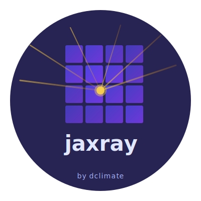

<div align="center">
  
  <p><strong>Labeled multi-dimensional arrays for JavaScript</strong></p>

  [](https://www.npmjs.com/package/jaxray)
  [](LICENSE)
  [](https://www.typescriptlang.org/)

  <p>A JavaScript/TypeScript implementation inspired by Python's <a href="https://xarray.pydata.org/">xarray</a> library</p>

  <p>
    <a href="#features">Features</a> •
    <a href="#installation">Installation</a> •
    <a href="#quick-start">Quick Start</a> •
    <a href="#api-reference">API</a> •
    <a href="#examples">Examples</a>
  </p>
</div>

---

## Why jaxray?

Working with multi-dimensional labeled data in JavaScript shouldn't be painful. jaxray brings the power of Python's xarray to the JavaScript ecosystem, making it easy to work with scientific data, climate datasets, and any labeled arrays.

**Perfect for:**
- 🌍 Climate and weather data analysis
- 📊 Time series with multiple dimensions
- 🗺️ Geospatial data processing
- 🔬 Scientific computing in the browser
- 📈 Large dataset streaming and processing

## Features

- ✨ **Labeled Arrays**: Named dimensions and coordinates like xarray
- 🎯 **Smart Selection**: Select by labels with nearest neighbor, forward/backward fill
- 🌊 **Streaming**: Process massive datasets chunk-by-chunk with progress tracking
- 📦 **Zarr Support**: Read sharded Zarr stores directly from IPFS
- 🔒 **Type-Safe**: Full TypeScript support with complete type definitions
- 💨 **Memory Efficient**: Stream large selections without loading everything
- 🔄 **Immutable**: All operations return new instances

## Installation

```bash
npm install jaxray
```

## Quick Start

### Creating a DataArray

```typescript
import { DataArray } from 'jaxray';

// Simple 1D array with labeled coordinates
const temperatures = new DataArray([20, 22, 25, 23, 21], {
  dims: ['time'],
  coords: {
    time: ['Mon', 'Tue', 'Wed', 'Thu', 'Fri']
  },
  attrs: {
    units: 'celsius',
    description: 'Daily temperatures'
  }
});

console.log(temperatures.data);  // [20, 22, 25, 23, 21]
console.log(temperatures.shape); // [5]
```

### Creating a 2D DataArray

```typescript
const gridData = new DataArray(
  [
    [1, 2, 3],
    [4, 5, 6]
  ],
  {
    dims: ['y', 'x'],
    coords: {
      y: [0, 10],
      x: [0, 10, 20]
    }
  }
);
```

### Selecting Data

```typescript
// Select by label
const wednesday = await temperatures.sel({ time: 'Wed' });
console.log(wednesday.data); // 25

// Select multiple values
const selected = await temperatures.sel({ time: ['Mon', 'Wed', 'Fri'] });
console.log(selected.data); // [20, 25, 21]

// Slice selection
const midweek = await temperatures.sel({ time: { start: 'Tue', stop: 'Thu' } });
console.log(midweek.data); // [22, 25, 23]

// Select by integer position
const byIndex = await temperatures.isel({ time: 2 });
console.log(byIndex.data); // 25
```

### Nearest Neighbor Selection

jaxray supports xarray-style nearest neighbor lookups and interpolation methods:

```typescript
const data = new DataArray([10, 20, 30, 40, 50], {
  dims: ['x'],
  coords: {
    x: [0, 5, 10, 15, 20]
  }
});

// Find nearest coordinate
const nearest = await data.sel({ x: 7 }, { method: 'nearest' });
console.log(nearest.data); // 20 (nearest to x=7 is x=5)

// Forward fill (last value <= target)
const ffill = await data.sel({ x: 12 }, { method: 'ffill' });
console.log(ffill.data); // 30 (last value where x <= 12 is x=10)

// Backward fill (first value >= target)
const bfill = await data.sel({ x: 12 }, { method: 'bfill' });
console.log(bfill.data); // 40 (first value where x >= 12 is x=15)

// With tolerance
const tolerant = await data.sel({ x: 7 }, {
  method: 'nearest',
  tolerance: 3
});
// Succeeds because distance is 2

// This would throw an error (distance 7 > tolerance 2)
await data.sel({ x: 13 }, { method: 'nearest', tolerance: 2 });
```

### Streaming Large Datasets

For large datasets that don't fit in memory, use streaming to process data in chunks:

```typescript
// Stream large time series data
const largeData = new DataArray(/* ... large array ... */, {
  dims: ['time'],
  coords: { time: /* ... */ }
});

const stream = largeData.selStream(
  { time: ['2020-01-01', '2020-12-31'] },
  { chunkSize: 50 } // Process in 50MB chunks
);

for await (const chunk of stream) {
  console.log(`Progress: ${chunk.progress}%`);
  console.log(`Processing ${chunk.bytesProcessed} / ${chunk.totalBytes} bytes`);

  // Process this chunk (e.g., write to file, compute statistics)
  await processChunk(chunk.data);
}
```

Streaming also works with Datasets:

```typescript
const stream = dataset.selStream(
  { time: ['2020-01-01', '2020-12-31'], lat: 45, lon: -73 },
  { chunkSize: 100, method: 'nearest' }
);

for await (const chunk of stream) {
  const temp = chunk.data.getVariable('temperature');
  const pressure = chunk.data.getVariable('pressure');

  // Write chunk to disk or process incrementally
  await writeToFile(temp, pressure);
}
```

### Aggregations

```typescript
// Sum all values
const total = temperatures.sum();
console.log(total); // 111

// Mean of all values
const average = temperatures.mean();
console.log(average); // 22.2

// Sum along a dimension
const rowSums = gridData.sum('x');
console.log(rowSums.data); // [6, 15]
```

### Working with Datasets

```typescript
import { DataArray, Dataset } from 'jaxray';

// Create multiple related DataArrays
const temp = new DataArray(
  [[15, 16], [18, 19]],
  {
    dims: ['lat', 'lon'],
    coords: {
      lat: [40.0, 40.5],
      lon: [-74.0, -73.5]
    }
  }
);

const pressure = new DataArray(
  [[1013, 1014], [1012, 1013]],
  {
    dims: ['lat', 'lon'],
    coords: {
      lat: [40.0, 40.5],
      lon: [-74.0, -73.5]
    }
  }
);

// Combine into a Dataset
const weather = new Dataset({
  temperature: temp,
  pressure: pressure
});

console.log(weather.dataVars); // ['temperature', 'pressure']
console.log(weather.dims);     // ['lat', 'lon']

// Select from Dataset
const location = await weather.sel({ lat: 40.0, lon: -73.5 });
const tempAtLocation = location.getVariable('temperature');
console.log(tempAtLocation?.data); // 16

// Works with nearest neighbor too
const nearLocation = await weather.sel(
  { lat: 40.2, lon: -73.7 },
  { method: 'nearest' }
);
```

### Merging Datasets

```typescript
const humidity = new DataArray([[65, 70], [68, 72]], {
  dims: ['lat', 'lon'],
  coords: {
    lat: [40.0, 40.5],
    lon: [-74.0, -73.5]
  }
});

const humidityData = new Dataset({ humidity });
const combined = weather.merge(humidityData);

console.log(combined.dataVars); // ['temperature', 'pressure', 'humidity']
```

## API Reference

### DataArray

#### Constructor

```typescript
new DataArray(data, options?)
```

**Parameters:**
- `data`: Multi-dimensional array of values
- `options`:
  - `dims`: Array of dimension names
  - `coords`: Coordinate values for each dimension
  - `attrs`: Metadata attributes
  - `name`: Name of the DataArray

#### Properties

- `data`: Get the underlying data
- `values`: Alias for data
- `dims`: Array of dimension names
- `shape`: Array of dimension sizes
- `coords`: Coordinate values
- `attrs`: Metadata attributes
- `name`: Name of the DataArray
- `ndim`: Number of dimensions
- `size`: Total number of elements

#### Methods

- `sel(selection, options?)`: Select by coordinate labels
  - `options.method`: Selection method ('nearest', 'ffill', 'bfill', 'pad', 'backfill')
  - `options.tolerance`: Maximum distance for method selection
- `selStream(selection, options?)`: Stream selection in chunks (returns AsyncGenerator)
  - `options.chunkSize`: Target chunk size in MB (default: 100)
  - `options.dimension`: Dimension to chunk along (default: auto-detect)
  - `options.method`: Selection method
  - `options.tolerance`: Maximum distance for method selection
- `isel(selection)`: Select by integer positions
- `sum(dim?)`: Sum along dimension (or all values)
- `mean(dim?)`: Mean along dimension (or all values)
- `toObject()`: Convert to plain JavaScript object
- `toJSON()`: Convert to JSON string

### Dataset

#### Constructor

```typescript
new Dataset(dataVars?, options?)
```

**Parameters:**
- `dataVars`: Object mapping variable names to DataArrays
- `options`:
  - `coords`: Shared coordinates
  - `attrs`: Metadata attributes

#### Properties

- `dataVars`: Array of variable names
- `dims`: Array of all dimension names
- `coords`: Shared coordinates
- `attrs`: Metadata attributes
- `sizes`: Object mapping dimension names to sizes

#### Methods

- `addVariable(name, dataArray)`: Add a new variable
- `getVariable(name)`: Get a variable by name (throws if not found)
- `get(key)`: Dictionary-style access - `get('varname')` or `get(['var1', 'var2'])`
- `hasVariable(name)`: Check if variable exists
- `removeVariable(name)`: Remove a variable
- `sel(selection, options?)`: Select by coordinate labels
  - `options.method`: Selection method ('nearest', 'ffill', 'bfill', 'pad', 'backfill')
  - `options.tolerance`: Maximum distance for method selection
- `selStream(selection, options?)`: Stream selection in chunks (returns AsyncGenerator)
  - `options.chunkSize`: Target chunk size in MB (default: 100)
  - `options.dimension`: Dimension to chunk along (default: auto-detect)
  - `options.method`: Selection method
  - `options.tolerance`: Maximum distance for method selection
- `isel(selection)`: Select by integer positions
- `map(fn)`: Apply function to all variables
- `merge(other)`: Merge with another Dataset
- `toObject()`: Convert to plain JavaScript object
- `toJSON()`: Convert to JSON string

## Examples

See the [examples](examples/) directory for more detailed usage examples.

## Development

```bash
# Install dependencies
npm install

# Build
npm run build

# Run tests
npm test
```

## License

ISC

## Contributing

Contributions are welcome! Please feel free to submit a Pull Request.

## Inspiration

This library is inspired by Python's [xarray](https://xarray.pydata.org/) library, which provides labeled multi-dimensional arrays for scientific computing.
